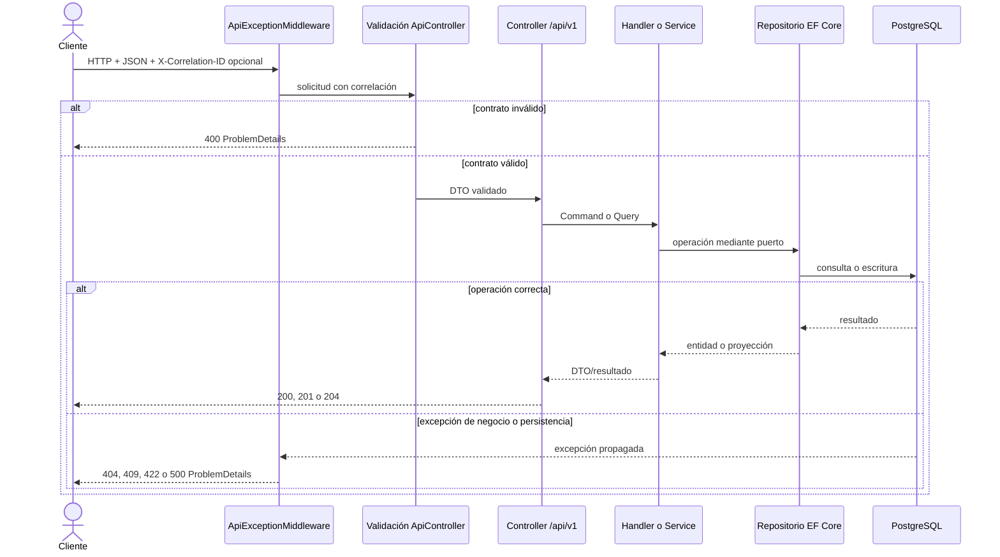
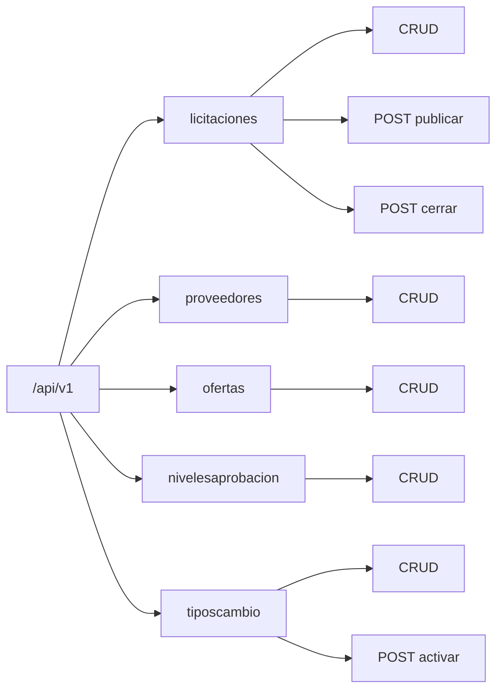

# API REST v1

Base local: `http://localhost:8080/api/v1`. Swagger: `/swagger`. Salud: `GET /health`. El cuerpo y las respuestas usan JSON en camelCase. Los ejemplos ejecutables de todos los recursos están en [`api-requests.http`](api-requests.http).

## Convenciones

- Los identificadores son UUID.
- Las fechas son ISO 8601 con zona, preferiblemente UTC (`2026-09-01T18:00:00Z`).
- Los montos CRC son números decimales; nunca `float`.
- Los listados aceptan `page` (predeterminado 1) y `pageSize` (predeterminado 20).
- `GET` responde 200; `POST` de creación 201; actualización y eliminación normalmente 204. Niveles y tipos de cambio devuelven el recurso actualizado con 200.
- Para editar licitaciones y proveedores se debe enviar el `rowVersion` obtenido en el detalle.

## Flujo de una solicitud



El middleware es el límite común para errores y correlación. Los controladores sólo traducen HTTP a commands/queries; los handlers y servicios aplican reglas, y los repositorios encapsulan EF Core.

## Mapa de recursos



## Endpoints

| Método y ruta | Entrada/filtros | Respuesta correcta |
|---|---|---|
| `GET /licitaciones` | `page`, `pageSize`, `search`, `estado`, `fechaDesde`, `fechaHasta`, `sortBy` | Página de `LicitacionListadoDto` |
| `GET /licitaciones/{id}` | UUID | `{ detalle, rowVersion }` |
| `POST /licitaciones` | `codigo`, `titulo`, `fechaCierre`, `presupuestoEstimadoCrc` | 201 `{ id, codigo }` |
| `PUT /licitaciones/{id}` | `titulo`, `fechaCierre`, `presupuestoEstimadoCrc`, `rowVersion` | 204 |
| `DELETE /licitaciones/{id}` | — | 204 (borrado lógico) |
| `POST /licitaciones/{id}/publicar` | — | 204 |
| `POST /licitaciones/{id}/cerrar` | `motivo` | 204 |
| `GET /proveedores` | `page`, `pageSize`, `search`, `sortBy` | Página de `ProveedorListadoDto` |
| `GET /proveedores/{id}` | UUID | `{ detalle, rowVersion }` |
| `POST /proveedores` | `nombre` | 201 `{ id, nombre }` |
| `PUT /proveedores/{id}` | `nombre`, `rowVersion` | 204 |
| `DELETE /proveedores/{id}` | — | 204 (borrado lógico) |
| `GET /ofertas` | `page`, `pageSize`, `licitacionId`, `proveedorId`, `sortBy` | Página de `OfertaListadoDto` |
| `GET /ofertas/{id}` | UUID | Oferta editable |
| `POST /ofertas` | `licitacionId`, `proveedorId`, `montoOfertadoCrc` | 201 `{ id, licitacionId, proveedorId }` |
| `PUT /ofertas/{id}` | `montoOfertadoCrc` | 204 |
| `DELETE /ofertas/{id}` | — | 204 |
| `GET /nivelesaprobacion` | `page`, `pageSize`, `search`, `sortBy=minimo|minimo_desc|aprobador` | Página de niveles |
| `GET /nivelesaprobacion/{id}` | UUID | Nivel |
| `POST /nivelesaprobacion` | `montoMinimoCrc`, `montoMaximoCrc`, `aprobador` | 201 Nivel |
| `PUT /nivelesaprobacion/{id}` | mismos campos | 200 Nivel |
| `DELETE /nivelesaprobacion/{id}` | — | 204 |
| `GET /tiposcambio` | `page`, `pageSize`, `activo`, `sortBy=fecha|fecha_asc|valor` | Página de tipos |
| `GET /tiposcambio/{id}` | UUID | Tipo de cambio |
| `POST /tiposcambio` | `crcPorUsd`, `fechaVigencia`, `activar` | 201 Tipo |
| `PUT /tiposcambio/{id}` | mismos campos | 200 Tipo |
| `POST /tiposcambio/{id}/activar` | — | 200 Tipo activado |
| `DELETE /tiposcambio/{id}` | — | 204 |

La envoltura de página contiene `elementos`, `totalRegistros`, `paginaActual`, `tamanoPagina` y `totalPaginas` (los listados implementados con `PaginaResultado` exponen el mismo concepto serializado desde sus propiedades).

## Ejemplos

Crear y editar una licitación:

```http
POST /api/v1/licitaciones HTTP/1.1
Content-Type: application/json

{
  "codigo": "LIC-2026-001",
  "titulo": "Compra de equipo",
  "fechaCierre": "2026-09-01T18:00:00Z",
  "presupuestoEstimadoCrc": 1000000.00
}
```

```http
PUT /api/v1/licitaciones/11111111-1111-1111-1111-111111111111 HTTP/1.1
Content-Type: application/json

{
  "titulo": "Compra de equipo actualizada",
  "fechaCierre": "2026-09-15T18:00:00Z",
  "presupuestoEstimadoCrc": 1100000.00,
  "rowVersion": 0
}
```

Registrar una oferta:

```json
{
  "licitacionId": "11111111-1111-1111-1111-111111111111",
  "proveedorId": "22222222-2222-2222-2222-222222222222",
  "montoOfertadoCrc": 850000.00
}
```

## Errores

La validación automática de DTO y el middleware responden `application/problem+json`. Todas las respuestas del middleware incluyen `X-Correlation-ID`; el cliente puede enviarlo si sólo contiene letras, números, punto, guion o guion bajo y no supera 128 caracteres.

| HTTP | `errorCode` habitual | Situación |
|---|---|---|
| 400 | `invalid_request` o validación automática | JSON/campos/parámetros inválidos |
| 404 | `resource_not_found` o respuesta vacía | Recurso inexistente |
| 409 | `duplicate_resource` | Código, nombre u oferta duplicada |
| 409 | `concurrency_conflict` | `rowVersion` obsoleto |
| 409 | `invalid_resource_state` / `operation_conflict` | Operación incompatible con el estado |
| 422 | `business_rule_violation` | Presupuesto, rango o regla de negocio inválida |
| 500 | `internal_error` | Error inesperado sin filtrar SQL, stack trace ni secretos |

Ejemplo:

```json
{
  "type": "about:blank",
  "title": "Regla de negocio no satisfecha",
  "status": 422,
  "detail": "El presupuesto no cubre las ofertas registradas.",
  "errorCode": "business_rule_violation",
  "correlationId": "cliente-123"
}
```

## Contrato comprobable

Swagger se genera desde los controladores y contratos. `ApiContractTests` comprueba rutas versionadas, los cinco recursos, acciones de publicar/cerrar y que no se expongan entidades del dominio. `ApiExceptionMiddlewareTests` comprueba 409, 422, 500, correlación y ocultamiento de información sensible.
