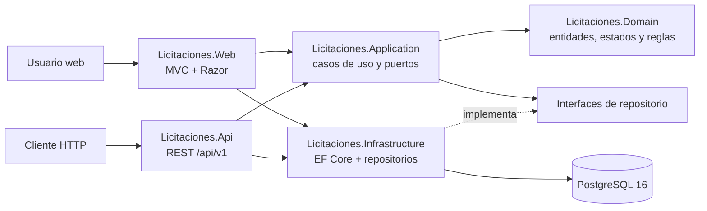
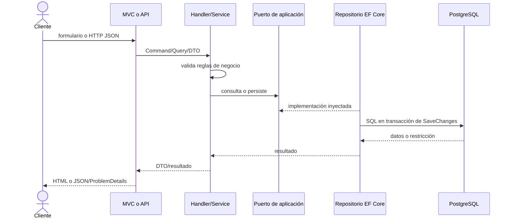

# Arquitectura general

El sistema es un monolito modular en .NET 9, organizado con una variante de arquitectura limpia. La interfaz MVC y la API REST reutilizan los mismos casos de uso; la infraestructura implementa los puertos de aplicación y PostgreSQL conserva la integridad final de los datos.

## Proyectos y dirección de dependencias

| Proyecto | Responsabilidad | Depende de |
|---|---|---|
| `Licitaciones.Domain` | Entidades `Licitacion`, `Proveedor`, `Oferta`, `NivelAprobacion`, `TipoCambio`; estados y reglas propias | Ningún proyecto de la solución |
| `Licitaciones.Application` | Casos de uso, DTO, validadores, servicios y puertos | Domain |
| `Licitaciones.Infrastructure` | `AppDbContext`, configuraciones EF Core, migraciones y repositorios PostgreSQL | Application, Domain |
| `Licitaciones.Web` | Interfaz MVC/Razor, ViewModels, validación de formularios y archivos estáticos | Application, Infrastructure y controladores API compartidos |
| `Licitaciones.Api` | Controladores REST v1, contratos, Swagger, validación y `ProblemDetails` | Application, Infrastructure |

La composición ocurre en los `Program.cs` de Web y API. `DependencyInjection.AddInfrastructure` registra `AppDbContext`, `IClock` y las implementaciones de todos los repositorios. Ningún controlador accede directamente a EF Core.

## Flujo de una solicitud

## Decisiones transversales

- PostgreSQL es la fuente de verdad. `database_schema.sql` define restricciones, índices, disparadores y semillas; las migraciones EF Core versionan el despliegue.
- Los montos se almacenan en CRC con `numeric`; USD es una representación calculada mediante el tipo de cambio activo.
- `row_version` implementa concurrencia optimista. Los conflictos se traducen a HTTP 409 en la API.
- `created_at`, `updated_at` y, donde aplica, `deleted_at` soportan auditoría; el reloj se abstrae con `IClock` para pruebas deterministas.
- Proveedores y licitaciones usan borrado lógico. Las ofertas no se pueden modificar cuando su licitación está cerrada o vencida.
- La API devuelve DTO, nunca entidades de dominio; los fallos usan `application/problem+json` y `X-Correlation-ID`.

## Ejecución y operación

La aplicación se puede ejecutar localmente, con Docker Compose o en Kubernetes. Ambos hosts exponen `/health`; Swagger está en `/swagger`. En el arranque se aplican migraciones cuando `Database:ApplyMigrationsOnStartup` es verdadero. El modo `Database:MigrationsOnly` ejecuta sólo migraciones, usado por el Job de Kubernetes.

Véanse [modelo de datos](modelo-datos.md), [integración de módulos](integracion-modulos.md), [API](api.md), [Docker](docker.md) y [Kubernetes](kubernetes.md).
