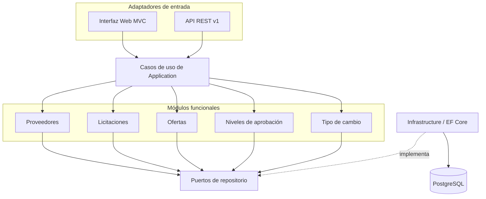
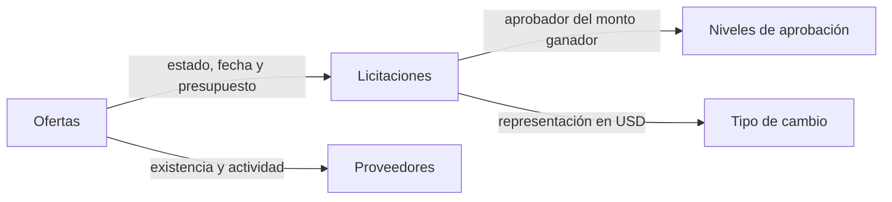
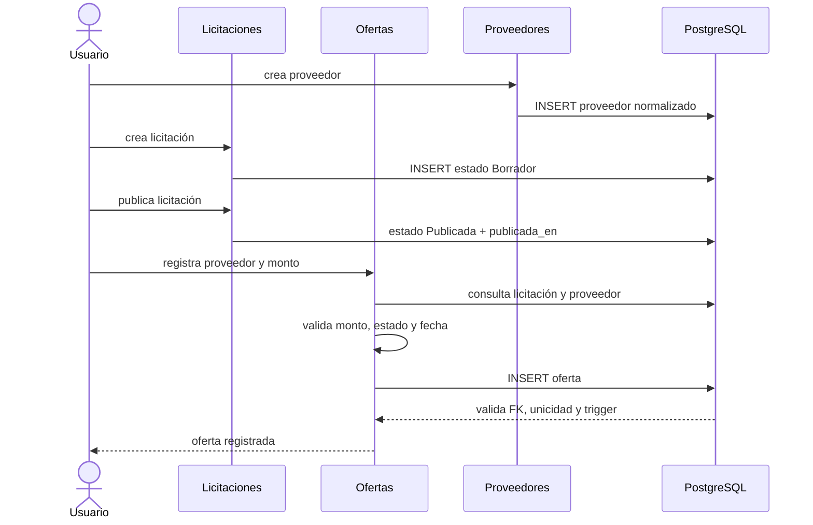

# Integración de módulos

Los módulos funcionales comparten casos de uso de `Licitaciones.Application` y se coordinan mediante interfaces; no se llaman entre controladores. Web y API son adaptadores de entrada, y los repositorios EF Core son adaptadores de salida.

El diagrama anterior muestra la dirección estructural de dependencias. Las colaboraciones de negocio se presentan aparte para evitar cruces entre capas:

## Contratos internos

| Productor/consumidor | Contrato | Finalidad |
|---|---|---|
| Entradas → Aplicación | Commands, Queries y DTO | Separar HTTP/MVC de los casos de uso |
| Aplicación → Persistencia | Interfaces `I*Repository` | Invertir la dependencia de EF Core |
| Ofertas → Licitaciones/Proveedores | `IOfertaValidacionRepository` | Comprobar licitación disponible, presupuesto y proveedor activo |
| Detalle de licitación → Niveles | `ResolverAprobadorService` | Obtener aprobador para el monto ganador |
| Detalle de licitación → Tipo de cambio | `ConversionMonedaService` y repositorio | Mostrar CRC/USD sin cambiar el monto fuente |
| Hosts → Tiempo | `IClock` | Usar UTC real en producción y reloj fijo en pruebas |

## Flujo: crear, publicar y recibir una oferta

## Flujo: consultar y cerrar una licitación

1. El detalle carga licitación, proveedores y ofertas activas.
2. `CalculadorMejorOferta` elige el menor monto y desempata por fecha de registro.
3. `ClasificadorAhorro` compara el monto ganador con el presupuesto.
4. `ResolverAprobadorService` consulta el rango configurado.
5. El tipo activo permite producir valores USD sólo para visualización.
6. Al cerrar se registra `cerrada_en` y el motivo. Las ofertas pasan a ser evidencia inmutable.

## Consistencia, transacciones y errores

Cada caso de escritura persiste mediante `SaveChangesAsync`; PostgreSQL aplica FKs, índices, checks y triggers dentro de la transacción. Las validaciones de aplicación ofrecen mensajes de negocio y las restricciones de base son la última defensa ante concurrencia. En API, el middleware traduce excepciones a 400, 404, 409, 422 o 500 con un identificador de correlación. En MVC, los controladores presentan mensajes junto al formulario o notificaciones.

## Integración operativa

- Docker Compose inicia PostgreSQL, espera su salud, aplica migraciones y expone la aplicación en el puerto configurado.
- Kubernetes usa ConfigMap/Secret, StatefulSet y PVC para la base, un Job de migración y Deployment/Service para la aplicación.
- CI restaura, compila, ejecuta suites y valida cobertura. Los detalles se
  encuentran en [pruebas](pruebas.md) y [CI/CD](ci-cd.md).
