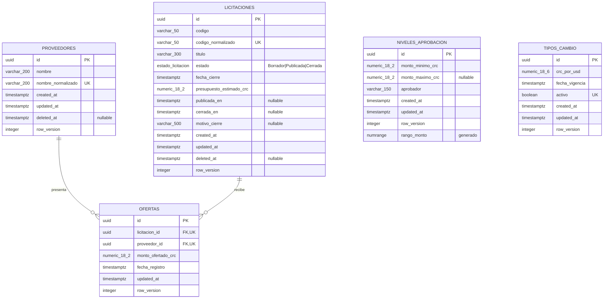
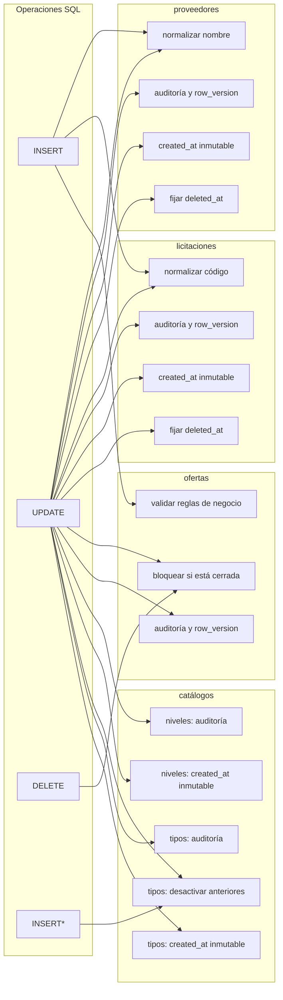

# Modelo de datos

Este documento se deriva de [`database_schema.sql`](../database_schema.sql), fuente de referencia solicitada por HU-52. El esquema utiliza PostgreSQL 16, UUID como claves primarias, `timestamptz` para fechas UTC y `numeric` para dinero.

## Diagrama entidad-relación

`UK` en ambos campos de `OFERTAS` representa la clave única compuesta `(licitacion_id, proveedor_id)`, no unicidad individual. Mermaid no expresa índices parciales ni restricciones de exclusión; se detallan a continuación.

## Relaciones e integridad

- Una licitación recibe cero o muchas ofertas; un proveedor presenta cero o muchas ofertas.
- Ambas claves foráneas de `ofertas` usan `ON DELETE RESTRICT`.
- Una pareja licitación–proveedor sólo puede tener una oferta.
- `niveles_aprobacion` y `tipos_cambio` son catálogos independientes, consultados por reglas de aplicación.
- No hay tabla de adjudicación: la mejor oferta se calcula por menor monto y, en empate, por `fecha_registro`.

## Restricciones relevantes

| Tabla | Garantía en base de datos |
|---|---|
| `proveedores` | Nombre no vacío y caracteres permitidos; nombre normalizado único entre filas no eliminadas |
| `licitaciones` | Presupuesto positivo, título no vacío y código normalizado único entre filas no eliminadas |
| `ofertas` | Monto positivo, FKs restrictivas y combinación licitación/proveedor única |
| `niveles_aprobacion` | Mínimo no negativo, máximo mayor al mínimo, aprobador no vacío, rangos sin traslape y un único rango abierto |
| `tipos_cambio` | Valor positivo y un único registro activo |

## Disparadores y funciones

- `fn_set_audit_fields` actualiza `updated_at` e incrementa `row_version`.
- `fn_preserve_created_at` impide cambiar la fecha de creación.
- `fn_set_deleted_at` fija el instante real del borrado lógico.
- Las funciones de normalización generan nombres de proveedor y códigos comparables.
- `fn_validar_oferta` exige licitación existente, activa, publicada, no vencida y monto dentro del presupuesto.
- `fn_bloquear_oferta_licitacion_cerrada` vuelve inmutables las ofertas cerradas o vencidas.
- `fn_desactivar_tipos_cambio_previos` conserva un solo tipo activo.

### Mapa de triggers

Las flechas indican qué función se ejecuta antes de cada operación. `INSERT*` representa un `INSERT` condicionado a que el nuevo tipo de cambio quede activo.

Correspondencia exacta con el SQL:

| Tabla | Trigger | Evento | Función |
|---|---|---|---|
| `proveedores` | `trg_proveedores_normalizar` | `INSERT` o cambio de `nombre` | `fn_normalizar_nombre_proveedor` |
| `proveedores` | `trg_proveedores_audit` | `UPDATE` | `fn_set_audit_fields` |
| `proveedores` | `trg_proveedores_created_at_inmutable` | `UPDATE` | `fn_preserve_created_at` |
| `proveedores` | `trg_proveedores_deleted_at` | cambio de `deleted_at` | `fn_set_deleted_at` |
| `licitaciones` | `trg_licitaciones_normalizar` | `INSERT` o cambio de `codigo` | `fn_normalizar_codigo_licitacion` |
| `licitaciones` | `trg_licitaciones_audit` | `UPDATE` | `fn_set_audit_fields` |
| `licitaciones` | `trg_licitaciones_created_at_inmutable` | `UPDATE` | `fn_preserve_created_at` |
| `licitaciones` | `trg_licitaciones_deleted_at` | cambio de `deleted_at` | `fn_set_deleted_at` |
| `ofertas` | `trg_ofertas_validar_negocio` | `INSERT` | `fn_validar_oferta` |
| `ofertas` | `trg_ofertas_bloquear_si_cerrada` | `UPDATE` o `DELETE` | `fn_bloquear_oferta_licitacion_cerrada` |
| `ofertas` | `trg_ofertas_audit` | `UPDATE` | `fn_set_audit_fields` |
| `niveles_aprobacion` | `trg_niveles_aprobacion_audit` | `UPDATE` | `fn_set_audit_fields` |
| `niveles_aprobacion` | `trg_niveles_aprobacion_created_at_inmutable` | `UPDATE` | `fn_preserve_created_at` |
| `tipos_cambio` | `trg_tipos_cambio_desactivar_previos` | `INSERT` o cambio de `activo`, cuando queda activo | `fn_desactivar_tipos_cambio_previos` |
| `tipos_cambio` | `trg_tipos_cambio_audit` | `UPDATE` | `fn_set_audit_fields` |
| `tipos_cambio` | `trg_tipos_cambio_created_at_inmutable` | `UPDATE` | `fn_preserve_created_at` |

## Datos semilla

El script crea tres niveles: Encargado de área (0.01–999999.99), Gerencia (1000000.00–9999999.99) y Junta Directiva (desde 10000000.00). También crea un tipo activo de referencia de 520 CRC/USD. El valor debe administrarse desde la aplicación.

## Mantenimiento

Todo cambio de entidad debe reflejarse primero en una migración y en `database_schema.sql`; después debe actualizarse este diagrama. Las pruebas de integración verifican migraciones, claves foráneas, checks, unicidad, transacciones, auditoría y concurrencia contra PostgreSQL real.
